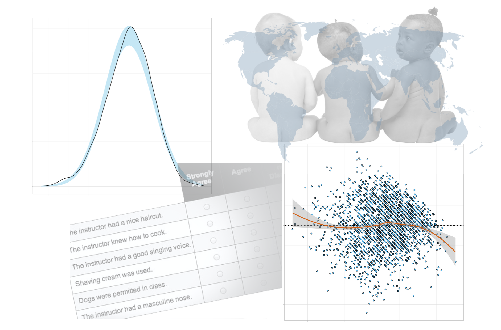

This goal of this assignment is to give you more experience evaluating the assumptions underlying regression models. Submit your responses to each of the questions below in a printed document. All graphics should be resized so that they do not take up more room than necessary and also should have an appropriate caption. This assignment is worth 15 points. (Each question is worth 1 point unless otherwise noted.)

```{r echo=FALSE, out.width="60%", fig.align='center'}

```

<br />

# Part I: Evaluating Assumptions for the Simple Regression Model

Research. Teaching. Service. The trifecta upon which that almost every university instructor is evaluated, and, ultimately compensated. One way which academic administrators judge teaching quality is through teachers' course evaluations. While we know evaluation scores are not perfectly measures of teaching quality, nonetheless, they do play a role in the tenure and promotion process. Unfortunately, many other non-teaching related factors are also associated with evaluation scores (e.g., professor's ethnicity, professor's sex). 

For this part of the assignment, you will examine whether instructor attractiveness explains differences in course evaluation scores---and thus on earnings differences. To do so, you will use the data in the *evaluations.csv* file to fit a regression model that uses professors' beauty ratings to predict the variation in course evaluation ratings.

- [[CSV]](https://raw.githubusercontent.com/zief0002/epsy-8251/master/data/evaluations.csv)
- [[Data Codebook]](http://zief0002.github.io/epsy-8251/codebooks/evaluations.html)


Fit the regression model to predict the variation in course evaluation ratings using professors’ beauty ratings. You will use the output from the fitted model to answer the questions in Part I.


### Preliminary Examination of Model Assumptions

1. Create and include the density plot for the **outcome**. Does the distribution foreshadow problems for the normality assumption? Explain.

2. Create and include the scatterplot of the **outcome vs. the predictor**. Include the loess smoother in the plots. Does this relationship foreshadow problems for the linearity assumption? Explain.

<br />


### Examination of the Standardized Residuals from the Simple Regression Model

3. Create and include the density plot of the marginal distribution of the **standardized residuals** from the fitted model. Add the confidence envelope for the normal distribution. Does this plot suggest problems about meeting the normality assumption? Explain.

4. Create and include the scatterplot of the **standardized residuals versus the fitted values** from the fitted model. In the plot identify observation with extreme residuals ($\leq-3$ or $\geq3$) by indicating  the row number of that observation in the plot.

5. Does this plot suggest problems about meeting the linearity assumption? Explain.

6. Does this plot suggest problems about meeting the homogeneity of variance assumption? Explain.

7. Is the independence assumption tenable? Explain.

<br />


## Part II: Evaluating Assumptions for the Multiple Regression Model

Human overpopulation is a growing concern and has been associated with depletion of Earth’s natural resources (water is a big one that ) and degredation of the environment. This, in turn, has social and economic consequences such as global tension over resources such as water and food, higher cost of living and higher unemployment rates. For this part of the assignment, you will use the file *fertility.csv* to fit a model in order to explore the effects of contraceptive use on fertility rates. 

- [[CSV]](https://raw.githubusercontent.com/zief0002/epsy-8251/master/data/fertility.csv)
- [[Data Codebook]](http://zief0002.github.io/epsy-8251/codebooks/fertility.html)

Fit the regression model to predict the variation in fertility rates using contraception use, female education, and infant mortality rate (three predictors). You will use the output from the fitted model to answer the questions in Part II.

<br />


### Preliminary Examination of Model Assumptions

8. Create and include the density plot for the **outcome**. Does the distribution foreshadow problems for the normality assumption? Explain.

9. Create and include the scatterplot of the **outcome vs. each predictor** (three total). Include the loess smoother in each of the plots. Do any of these relationships foreshadow problems for the linearity assumption? Explain. **(2pts.)**

<br />


### Examination of the Standardized Residuals from the Multiple Regression Model

10. Create and include the density plot of the marginal distribution of the **standardized residuals** from the fitted model. Add the confidence envelope for the normal distribution. Does this plot suggest problems about meeting the normality assumption? Explain.

11. Create and include the scatterplot of the **standardized residuals versus the fitted values** from the fitted model. In the plot identify observation with extreme residuals ($\leq-3$ or $\geq3$) by indicating  the country associated with that observation in the plot.

12. Does this plot suggest problems about meeting the linearity assumption? Explain.

13. Does this plot suggest problems about meeting the homogeneity of variance assumption? Explain.

14. Is the independence assumption tenable? Explain.
