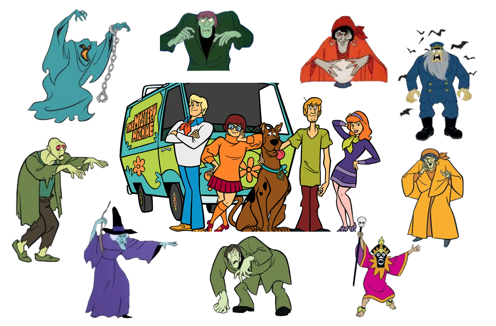

The goal of this assignment is to give you more experience fitting and interpreting regression models with categorical predictors. Submit your responses to each of the questions below in a printed document. All graphics should be resized so that they do not take up more room than necessary and also should have an appropriate caption. This assignment is worth 15 points. (Each question is worth 1 point unless otherwise noted.)

```{r echo=FALSE, out.width="60%", fig.align='center'}

```

<br />

For this assignment, you will be fitting several regression models to examine whether there are differences in the engagement level of reviewers on IMDb for Scooby-Doo episodes/movies based on which members of Mystery Inc caught the villain. To do so, you will use the data in the file *scoobydoo.csv*.


- [[CSV]](https://raw.githubusercontent.com/zief0002/epsy-8251/master/data/scoobydoo.csv)
- [[Data Codebook]](http://zief0002.github.io/epsy-8251/codebooks/scoobydoo.html)

<br />


# Preparation: Create Dummy Variables

Create four dummy variables for the analysis; one for each condition of the `caught_by` attribute. Also create another dummy variable to represent media format.

<br />


# Description

1. Create a table of pairwise correlations between engagement, each of the four dummy variables you created to represent `caught_by`, IMDb rating, number of catchphrases uttered, and the media format dummy variable.

2. Interpret (i) the correlation between the Shaggy/Scooby dummy variable and engagement, and (ii) the correlation between the Shaggy/Scooby dummy variable and the media format dummy variable.

<br />


# Unadjusted Group Differences Model: ANOVA

Fit the regression model that uses the dummy predictors for which Mystery Inc. members caught the villain to predict variation in IMDb engagement. In this model, use Shaggy/Scooby as the reference group.

3. Write the fitted regression equation.

4. Which conditions of `caught_by`, if any, differ from Shaggy/Scooby in the average engagement on IMDb produced (more than we expect because of sampling variation)? Explain.

5. Report and interpret the $R^2$ value for this model.

6. Which comparisons of the `caught_by` condition reflected in the omnibus null hypothesis are not represented in this fitted model?

<br />


# Adjusted Group Differences Model: ANCOVA

Again, fit the regression model that uses the dummy predictors for which Mystery Inc. members caught the villain to predict variation in average IMDb engagement, but this time control for differences in (1) IMDb rating, (2) number of catchphrases uttered, and (3) media format. Again, use Shaggy/Scooby as the reference group.

7. Write the fitted regression equation.

8. Which conditions of `caught_by`, if any, differ from Shaggy/Scooby in the average IMDb engagment (more than we expect because of sampling variation) after controlling for differences in these other predictors? Explain

9. Report and interpret the $R^2$ value for this model.

<br />


# Assumptions

10. Create the density plot of the marginal distribution of the standardized residuals from the ANCOVA model. Add the confidence envelope for the normal distribution. Explain whether or not this plot suggests problems about meeting the normality assumption.

11. Create the scatterplot of the standardized residuals versus the fitted values from the ANCOVA model. In the plot identify observation with extreme residuals ($\leq-3$ or $\geq3$) by indicating  the row number of that observation in the plot.

12. Explain whether or not this plot suggests problems about meeting the linearity and homogeneity of variance assumptions.

<br />


# Pairwise Differences

Use the results from comparing the pairwise differences between the conditions of `caught_by` in the ANCOVA model to answer the questions in this section.

13. Create a table (suitable for publication) that presents each of the possible pairwise contrasts (null hypotheses) of interest, the unadjusted _p_-values from the controlled model, and the Benjamini--Hochberg adjusted _p_-values for the controlled differences. (Note: To obtain all of these, you may need to fit additional models.)

14. Use the Benjamini--Hochberg adjusted _p_-values from the controlled model to help answer the research question: Are there differences in the engagement level of reviewers on IMDb for Scooby-Doo episodes/movies based on which members of Mystery Inc caught the villain? In answering this question, also indicate how IMDb engagement differs for the conditions of `caught_by`. 

15. Create a heatmap of the Bonferroni *p*-values for the controlled model that you reported in the table in Question 13. You can see an example of a [heatmap for correlations here](https://towardsdatascience.com/all-about-heatmaps-bb7d97f099d7). We want to create a heatmap that shows the *p*-value for each pairwise comparison instead of the correlation between variables. So for example, the heatmap we want to create should be a 4x4 grid (the rows and columns would represent conditions of `caught_by`) and the intersecting cells would include the *p*-value for the comparison (rather than the correlation coefficient). Color will be used to indicate the magnitude of the *p*-values. You may want to include different levels of color depending on the size of the *p*-value ($<.05$, $<.01$, etc.) Feel free to use any software tool you want to create this heatmap.


