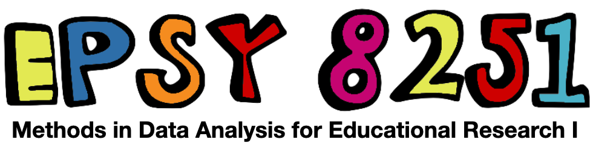

```{r knitr_init, echo=FALSE, cache=FALSE}
library(knitr)
library(rmdformats)
library(fontawesome)

## Global options
options(max.print="75")
opts_chunk$set(echo=FALSE,
	             cache=TRUE,
               prompt=FALSE,
               tidy=TRUE,
               comment=NA,
               message=FALSE,
               warning=FALSE)
opts_knit$set(width=75)
```

# Welcome to EPsy 8251




In this class, we will work together to develop a learning community that is inclusive and respectful, and where every student is supported in the learning process. As a class full of diverse individuals (reflected by differences in race, culture, age, religion, gender identity, sexual orientation, socioeconomic background, abilities, professional goals, and other social identities and life experiences) I expect that different students may need different things to support and promote their learning. The TAs and I will do everything we can to help with this, but as we only know what we know, we need you to communicate with us if things are not working for you or you need something we are not providing. I hope you all feel comfortable in helping to promote an inclusive classroom through respecting one another's individual differences, speaking up, and challenging oppressive/problematic ideas. Finally, I look forward to learning from each of you and the experiences you bring to the class. 


<!-- - **Syllabus, assignments, data, and script files:** [github repository](https://github.com/zief0002/epsy-8251) -->
<!-- - **Course notes and readings:** [website](https://zief0002.github.io/book-8252/) | [github repository](https://github.com/zief0002/book-8252) -->

<!-- *Note that the Zoom links for the class meetings and for office hours are different.* The links given in the contact information are for office hours and that in the classroom information is for the synchronous portion of the class. -->


<br />

### Instructor {-}

Andrew Zieffler ([zief0002@umn.edu](mailto://zief0002@umn.edu)) <br />
<!-- **Virtual Office:** [Zoom](https://umn.zoom.us/my/zieffler)  <br /> -->
**Physical Office:** [Education Sciences Building 178](https://www.google.com/maps/place/Education+Sciences+Building/@44.9784043,-93.2394586,15z/data=!4m2!3m1!1s0x0:0x45656dac481b9150)  <br />
**Office Hours:** Monday 9:00 AM&ndash;10:00 AM; and by appointment
**Virtual Office:** If you want to meet virtually, send me a Google calendar invite and include a Zoom link.

### Teaching Assistant {-}

Peter Li ([lixx1474@umn.edu](mailto://lixx1474@umn.edu))  <br />
<!-- **Virtual Office:** [Zoom](https://umn.zoom.us/j/92506698122?pwd=MkJFNFVPb2dDZ3JKdTF1Vzh4M1NtQT09)  <br /> -->
**Physical Office:** [Education Sciences Building 193](https://www.google.com/maps/place/Education+Sciences+Building/@44.9784043,-93.2394586,15z/data=!4m2!3m1!1s0x0:0x45656dac481b9150)  <br />
**Office Hours:** Tuesday 10:00 AM&ndash;11:00 AM; and by appointment

<br />


### Classroom

- Monday/Wednesday (2:30&ndash;3:45): [Appleby Hall 03](https://www.google.com/maps/place/Appleby+Hall/@44.9748768,-93.2394822,17z/data=!4m12!1m6!3m5!1s0x52b32d15b19f387f:0x92794f0611813034!2sAppleby+Hall!8m2!3d44.974873!4d-93.2372882!3m4!1s0x52b32d15b19f387f:0x92794f0611813034!8m2!3d44.974873!4d-93.2372882) 


<br />


### Course Content and Syllabus {-}

- The course syllabus is available  [here](https://github.com/zief0002/epsy-8251/raw/master/syllabus/f21-8251-syllabus.pdf).
- [Message from Snoop Dogg](https://t.co/5X88O0DBUZ?amp=1) about the syllabus


<br />


### Textbooks {-}

The course textbook is available via the University of Minnesota library.

- [Applied regression: An introduction](https://primo.lib.umn.edu/primo-explore/fulldisplay?docid=UMN_ALMA21533776460001701&context=L&vid=TWINCITIES&search_scope=mncat_discovery&tab=article_discovery&lang=en_US) [required]


<br />


```{r child = 'schedule.Rmd'}
```


```{r child = 'assignments.Rmd'}
```


```{r child = 'data.Rmd'}
```


```{r child = 'readings.Rmd'}
```


