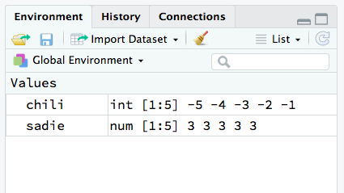
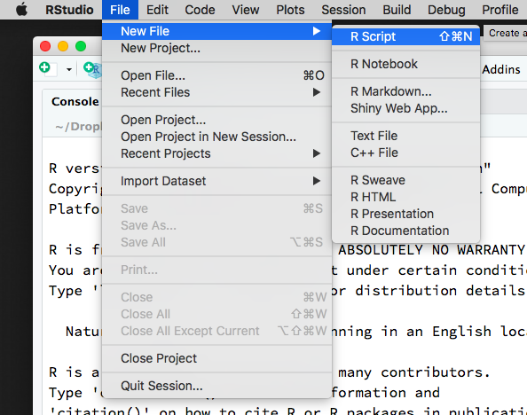
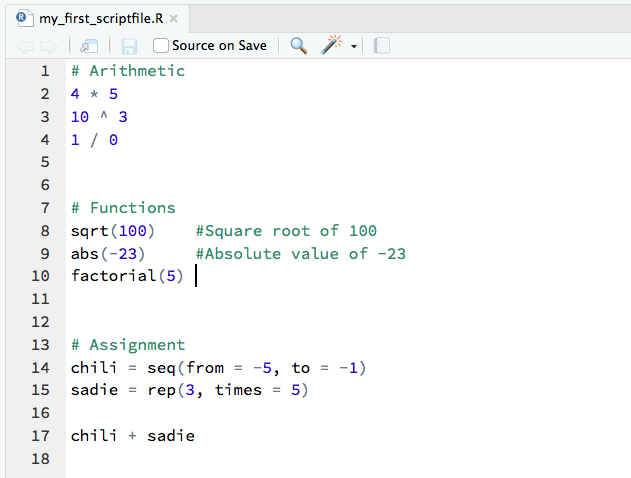
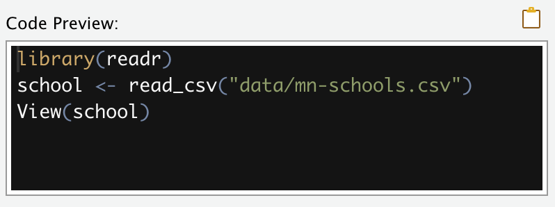

```{r setup, include=FALSE, message=FALSE}
options(htmltools.dir.version = FALSE, servr.daemon = TRUE, scipen = 99)
library(knitr)
library(kableExtra)
library(dplyr)
```


# RStudio


Console tab: Interactive typing

---

# Interactive Computation

.pull-left[
```{r}
# Multiplication
4 * 5

# Exponents
10 ^ 3

# Division
1 / 0
```
]

.pull-right[
Space is not important for the computation. All the following computations are the same in R:

```
> 4 * 5
> 4*5
> 4  *5
```

Since it is easier to read (and debug) code that has spaces, you should use spaces in your code.
]

---

# Functions

.pull-left[
Almost all commands in R are built around the use of a function. 

Functions carry out operations on their inputs (called *arguments*) and produce an output (called a *returned value*).

The application of a function to arguments follows a simple structure. The name of the function is followed by a pair of parentheses. Values for the arguments are specified inside the parentheses. For example, 

```
   function_name(argument)
```

]

.pull-right[
```{r}
# Square root
sqrt(100)

# Absolute value
abs(-23)

# Factorial
factorial(5)
```
]

---

# Multiple Arguments to a Function

.pull-left[
Functions can take multiple arguments (inputs).  If there is more than one argument, the arguments are always separated by a comma.

```
   function_name(argument_1, argument_2)
```

If the arguments are unnamed, the order matters.

If the arguments are named, then the order does not matter.

Conventionally, the first argument is often unnamed and any other arguments are named.
]

.pull-right[
```{r}
# Unnamed arguments; order matters
seq(1, 5)
seq(5, 1)


# Named arguments; order does not matter
seq(from = 1, to = 5)
seq(to = 5, from = 1)
```
]

---

# Connecting Computations: Chaining


Functions can be inputs into other functions.

```
   g( f(x) )
```

<br />

For example, we can find the absolute value of all the integers between -5 and -1. 

```{r}
abs( seq(from = -5, to = -1) )
```

<br />

We can chain as many computations together as we would like.

```{r}
sqrt( abs( seq(from = -5, to = -1) ) )
```

---

# Connecting Computations: Assignment


We can also connect computations through assignment. We store the output of a computation by assigning that computations to a *named object*. We then use that named object in another computation. 

<br />

For example, here we first store the integers between -5 and -1 in an object called `chili`. Then we find the absolute value of them by using `chili` as the argument in the `abs()` function. 

```{r}
chili = seq(from = -5, to = -1) 
abs(chili)
```

---

# Naming Objects


```{r}
sadie = rep(3, times = 5) 
sadie

chili + sadie
```

<br />

Pretty much any name can be used, although names cannot begin with a digit nor include hyphens or spaces. Although legal, `chili` and `sadie` are not good object names because they do not describe their content.

I tend to use all lowercase letters in my object names and use underscores for word breaks. For example,

- `sex`, `race` `ses`, `gpa`
- `act_math`, `mothers_educ`


---

# Assignment and the Environment

.pull-left[
We can continue to use `chili` and `sadie` in our computations, so long as they remain in our *Environment*. 



```{r}
sum(chili)
prod(sadie) #Product
```
]

.pull-right[
When an object name is re-used, the previous value of the object is lost.

```{r}
chili = seq(from = 1, to = 10)
sum(chili)
```
]

---

# Script Files: Recording Your Work

We record the R syntax we use in a *script file*. You can get a new script file by selecting `File > New File > R Script`. You can also obtain a new R script via the `New File` icon (document with the plus-sign) on the tool bar.

.pull-left[

]

.pull-right[

]

---

# Anatomy of a Script File

Script files should only include your R syntax and comments. Script files should NOT include:

- prompts (`>`)
- output

```{r, echo=FALSE, out.width = "400px"}

```


Comments are indicated using the hashtag (\#). These can be placed on their own line in the script file, or can be placed at the end of a line with syntax.

---

# Executing Syntax in a Script File

Syntax in the script file can be executed by highlighting it and pressing the `Run` button in the toolbar.

```{r, echo=FALSE}
knitr::include_graphics("images/notes-01-run-button.png")
```

---

# Adding Functionality: Packages (Libraries)

R functions are stored in packages (or libraries). There over 12,000 different packages available on CRAN (as of June 2018), and more on github, webpages, etc. 

```{r, echo=FALSE}
knitr::include_graphics("images/notes-01-packages.png")
```

---

To use the functions in a particular package, the package needs to be (1) installed, and (2) loaded into memory. 

```{r, echo=FALSE, out.width='700px'}
knitr::include_graphics("images/notes-01-install-load.png")
```

---

Several packages are pre-installed when you download R. When you start an R session by opening RStudio, some of those packages are also loaded into memory.

```{r, echo=FALSE, out.width='600px'}
knitr::include_graphics("images/notes-01-packages-2.png")
```

---

# Installing New Packages

```{r, echo=FALSE, out.width='750px'}
knitr::include_graphics("images/notes-01-install-process.png")
```

---

# Loading an Installed Package

The `library()` function is used to load packages that have previously been installed.

```{r}
# Here we load two pre-installed packages
library(MASS)
library(survival)
```

Some packages requires other packages (dependencies) to work. For example, the **survival** package is dependent on the **splines** package. Once the package is loaded, all of the functions, data sets, etc. in that package are available to you. Packages will need to be loaded every time you launch a new R session.

---

Sometimes you will get a message about objects being *masked*. This is not a problem. It is just informative and means that the more recently loaded package has a function that has the exact same name as a previously loaded package. If you use that function, the more recently loaded package's version will be used.

.small[
```{r}
# Here we load the dpplyr package we just installed
library(dplyr)
```
]

For example, both the **dplyr** package and the **stats** package (which is loaded by default when you start an R session) have a function called `filter()` and `lag()`. If we use either function, the one from the **dplyr** package will be used since **dplyr** was loaded more recently than **stats**.

---

# Data Structure: Vectors

Vectors are the data structure R uses to store univariate collections of data (single variable). To create a vector we will use the `c()` function to input the individual elements, and assign this to an object.

```{r}
# Create an age variable
age = c(44, 40, 12, 6)
```

Note that once we assign create `age` it shows up in our environment.

```{r}
# Find the mean age
mean(age)

# Find the standard deviation of age
sd(age)
```

---

# Vector Type: Logical Vector

The `age` vector we created is a *numeric* vector: all the elements are numbers. Another vector type we will use in this class is a *logical* vector. Each element in a logical vector is either `TRUE` or `FALSE` (all uppercase letters). Although we could use the `c()` function to create these, they will almost always be the result of applying a computation to an existing vector. 

```{r}
# Which elements are > 30
age > 30
```

Logical elements have numeric values associated with them, namely, `FALSE` = 0 and `TRUE` = 1. This means we can apply computations to a logical vector.

```{r}
sum(age > 30)
mean(age > 30)
```

---

# Logical Operations

.small[
```{r}
# Greater/less than
age > 30
age < 30

# Greater/less than or equal to
age >= 12
age <= 40

# Equal to
age == 44

# Not equal to
age != 40
```
]

Note that we use two equal signs for the logical "is equal to". If you only use one equal sign, R will interpret that as assignment!


---

# Vector Type: Character Vector

Another vector type we will use in this class are *character* vectors (a.k.a., strings, literals). Each element in a character vector is a string of characters delimited by quotation marks.

```{r}
sex = c("male", "female", "female", "female")
```

Many operations/functions that worked on numeric and logical vectors do not work on character vectors.

```{r}
mean(sex)
```

---

# Data Structure: Data Frames and Tibbles

Data frames are the most common structures we will be working with in the course. For example, when we import data into RStudio, it will typically be stored as a data frame (or as a related structure called a tibble). 

Data frames and tibbles have a tabular (rectangular) structure made up of rows (cases) and columns (variables).

```{r, echo=FALSE, message=FALSE}
school = readr::read_csv("~/Documents/github/epsy-8251/data/mn-schools.csv")

school %>%
  slice(1:6) %>%
  kable(
    caption = "First Six Rows of the Minnesota Schools Data",
    format = "html"
  )
```


---

# Importing External Data into RStudio

```{r, echo=FALSE, out.width='750px'}
knitr::include_graphics("images/notes-01-import-data.png")
```

---

# Script File: Importing Data

The syntax in the `Code Preview` window of the `Import` screen is what R actually uses to read in your data. The function `read_csv()` from the **readr** library is what is being used to import the data. This is then assigned to the object `school`. (Note that `<-` can be used instead of `=` for assignment.) The first two lines of syntax should be copied into your script file.

```{r, echo=FALSE, out.width='500px'}

```

**\#Protip:** On a Mac, you may need to add  `~/` to the beginning of the path name. For example, `school = read_csv("~/data/mn-schools.csv")`

**\#Protip:** The `View()` function only works with RStudio. This is not essential for importing the data.

---

# Working with a Variable in a Data Frame


To access variables (columns) within the data frame, we need to identify that the variable is a column within the particular data frame. If we try to execute the syntax `mean(sat)` to find the mean SAT score in the data, we will get an error.

```
mean(sat)

Error in mean(sat) : object 'sat' not found
```

R looks to the environment for an object alled `sat` and can't find it. `sat` is a column name within the `school` data frame. (`school` is in the environment; not `sat`.) So we need to indicate this by first giving the name of the data frame, and then the column name (`sat`), separated by the `$` operator.

```{r}
# Need to identify data frame with siblings
mean(school$sat)
```

---


# To-Do List

Before the next class period, carry out the following tasks.

Install the following packages:

- **dplyr**
- **ggplot2**

Download the *riverview.csv* data set from the course website to your computer. Import the data into RStudio. If all goes well, the data frame should have six columns (variables) and 32 rows (cases).  Open a new script file and record and comment on the syntax for each of the following:

- Compute the mean income for the 32 employees.
- Compute the standard deviation of incomes for the 32 employees.
- Use the `summary()` function to summarize the variables in the dataset. Do this by giving this function the object name of the data as its input. For example, if you assigned the name `river` to the data when you imported it, you would use `summary(river)`.
- Load the **dplyr** and **ggplot2** packages using the `library()` function and make sure there are no errors when you load either package. 


