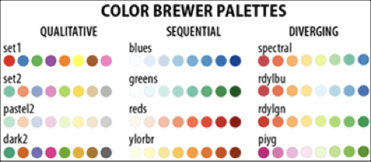

```{r setup, include=FALSE}
options(htmltools.dir.version = FALSE, servr.daemon = TRUE, scipen = 999)
```


# Preparation

```{r message=FALSE}
# Load libraries
library(dplyr)
library(ggplot2)
library(readr)

# Import and view the city data 
city = read_csv("~/Documents/github/epsy-8251/data/riverview.csv")
head(city)
```


---

# Understanding the Basic Syntax

Plots are built by *layering* different components. 

```{r eval=FALSE}
ggplot(data = city, aes(x = education, y = income)) + 
  geom_point() +
  theme_bw()
```

In this syntax there are three layers:

1. a global layer, 
2. a geometric layer, and 
3. a theme layer. 

The layers are literally *summed* together to form the plot.


---

# The Global Layer

The first layer (referred to as the global layer) is always `ggplot()`. It contains reference to the source data (data frame object) and any *global aesthetic mappings*. The first layer only sets up the plot, it doesn’t actually plot anything. (In the subsequent layers, we add geometric objects (e.g., points, boxplots), themes, etc.)

```{r eval=FALSE}
ggplot(data = city, aes(x = education, y = income)) +
```

- The `data=` argument indicates the source data frame.
- The `aes=` argument sets the aesthetic mapping(s).

---

# Adding Geometric Objects

Geometric objects are features that are actually drawn on plot (e.g., lines, points). They are specified using the prefix `geom_` and a suffix that names the feature to be plotted.

.pull-left[.smallish[
```{r eval=FALSE}
ggplot(data = city, aes(x = education, y = income)) + 
  geom_point()
```

- **Points** specified with `geom_point()`
- **Jittered points** specified with `geom_jitter()`
- **Lines** specified with `geom_line()`
- **Boxplots** specified with `geom_boxplot()`
]]

.pull-right[
```{r echo=FALSE}
ggplot(data = city, aes(x = education, y = income)) + 
  geom_point(size = 4)
```
]

---

# Aesthetic Mappings

Aesthetic mappings describe how variables in the data are **mapped to visual properties** (aesthetics) in the plot. They are used to define visual properties such as: position (e.g., $x$-dimension, $y$-dimension), size, color, fill, and groupings.

```{r eval=FALSE}
ggplot(data = city, aes(x = education, y = income)) +
  geom_point()
```

In this example there are two aesthetic mappings.

1. Education values from the data are mapped to the $x$-position for each observation.
2. Income values from the data are mapped to the $y$-position for each observation.

All aesthetic mappings (data mapped to visual property) need to be specified in the `aes()` function. Mappings apply different values for the visual property based on the data. The geometric objects (in this example, points) are plotted based on the aesthetic mappings specified in the global layer. For example, the syntax above draws points at the ordered pairs of employees’ education ($x$-position) and incomes ($y$-position) as specified in the `city` data.

---

# Adding Layers

When layers are added they are "stacked" on top of previous layers. Imagine drawings on separate transparencies, and then those transparencies are stacked. 

.pull-left[.smallish[
```{r eval=FALSE}
ggplot(data = city, aes(x = education, y = income)) + 
  geom_point() + 
  geom_smooth()
```

Here the `geom_smooth()` layer (which adds a loess smoother) is drawn ON TOP of the points, which are added in the `geom_point()` layer.

]]

.pull-right[
```{r echo=FALSE, message=FALSE}
ggplot(data = city, aes(x = education, y = income)) + 
  geom_point(size = 4) + 
  geom_smooth()
```
]

---

# Good Syntactic Habits

As we add multiple layers to build up our plot, it is a good habit to use multiple lines for the syntax. Generally we put one layer on each line. 

```{r eval=FALSE}
ggplot(data = city, aes(x = education, y = income)) + 
  geom_point() + 
  geom_smooth() +
  theme_bw()
```

The `+` sign needs to be at the end of the line (not at the beginning). If you are using a script file (which you should be), highlight ALL layers in the plot and click `Run` to create the plot.

---

# Global vs. Local Aesthetic Mappings

Aesthetic mappings can be set globally (in `ggplot()` layer) or locally (set in a specific layer). Aesthetic mappings that are set in the `ggplot()` layer are applied to *all layers* in the plot; they are global. Aesthetic mappings set in a specific layer only apply to that particular layer.

.pull-left[.smallisher[
```{r message=FALSE, eval=FALSE}
ggplot(data = city, aes(x = education, y = income, color = gender)) + 
  geom_point() +
  geom_smooth()
```

```{r message=FALSE, out.width='90%', echo=FALSE}
ggplot(data = city, aes(x = education, y = income, color = gender)) + 
  geom_point(size = 4) +
  geom_smooth()
```

]]


.pull-right[.smallisher[
```{r message=FALSE, eval=FALSE}
ggplot(data = city, aes(x = education, y = income)) + 
  geom_point(aes(color = gender)) +
  geom_smooth()
```

```{r message=FALSE, out.width='90%', echo=FALSE}
ggplot(data = city, aes(x = education, y = income)) + 
  geom_point(aes(color = gender), size = 4) +
  geom_smooth()
```
]]


---

# Fixed Aesthetics

Fixed aesthetics assign the exact same value for the visual property for **all** the observations; it is not based on the data. Fixed aesthetics are specified outside the `aes()` function. For example, the following syntax uses the data to assign the $x$- and $y$-positions (aesthetic mapping), but then colors *all of the observations* red and makes *all of the observations* size 4 (default is `size=3`).

.pull-left[.smallish[
```{r eval=FALSE}
ggplot(data = city, aes(x = education, y = income)) + 
  geom_point(color = "red", size = 4) +
  theme_bw()
```
]]

.pull-right[
```{r echo=FALSE, out.width='90%'}
ggplot(data = city, aes(x = education, y = income)) + 
  geom_point(color = "red", size = 4) +
  theme_bw()
```
]
---

# Your Turn

```{r eval=FALSE}
ggplot(data = city, aes(x = education, y = income, color = gender)) +
  geom_point() +
  geom_smooth(color = "yellow", fill = "darkblue")
```


.pull-left[.smallish[
- What are the aesthetics in the following plot?
- Which aesthetics are mapped to the data and which are fixed?
- Which aesthetics are global and which are local?
- What are the geometric objects?
]]

.pull-right[
```{r echo=FALSE, out.width='90%', message=FALSE}
ggplot(data = city, aes(x = education, y = income, color = gender)) +
  geom_point(size = 4) +
  geom_smooth(color = "yellow", fill = "darkblue")
```
]

---

# Your Turn

- Write the syntax to create this scatterplot.
- How would we color the points by political party?

```{r echo=FALSE, message=FALSE, out.width='50%'}
ggplot(data = city, aes(x = gender, y = education)) +
  geom_point(size = 4)
```

---

# Useful Point Aesthetics

Two other useful aesthetics for points are `shape=` and `size=` for plotting the shapes and sizes of points, respectively. 

.pull-left[.smallish[
```{r eval=FALSE}
ggplot(data = city, aes(x = education, y = income)) +
  geom_point(aes(color = party, shape = gender), size = 4)
```
]]

.pull-right[
```{r echo=FALSE, fig.width=8, fig.height=6}
ggplot(data = city, aes(x = education, y = income)) +
  geom_point(aes(color = party, shape = gender), size = 4)
```
]

Notice when we use non-positional aesthetic mappings (e.g., color, shape) a legend will be automatically added to our plot for each aesthetic mapping.

---

# Faceting: Separate Plots for Subgroups

.pull-left[
Faceting creates a separate plot for each subgroup declared. To facet on a single predictor use the `facet_wrap()` layer. The wiggle/tilde (`~`) sets the predictor for facetting on.

.smallish[
```{r eval=FALSE}
ggplot(data = city, aes(x = education, y = income)) +
  geom_point() +
  facet_wrap(~ party, nrow = 2)
```
]


]

.pull-right[
```{r echo=FALSE}
ggplot(data = city, aes(x = education, y = income)) +
  geom_point(size = 4) +
  facet_wrap(~ party, nrow = 2)
```
]
---

# Facetting on Multiple Variables

.pull-left[
When facetting on multiple predictors, use `facet_grid(rows ~ columns)`

.smallish[
```{r eval=FALSE}
ggplot(data = city, aes(x = education, y = income)) +
  geom_point() +
  facet_grid(party ~ gender)
```
]
]

.pull-right[
```{r echo=FALSE, fig.width=8, fig.height=12, out.width='90%'}
ggplot(data = city, aes(x = education, y = income)) +
  geom_point(size = 4) +
  facet_grid(party ~ gender)
```
]

---

# Changing the Axis Label

The layers `xlab()` and `ylab()` can be used to change the label on the $x$- and $y$-axes, respectively.

.pull-left[
.smallish[
```{r eval=FALSE}
ggplot(data = city, aes(x = education, y = income)) +
  geom_point() +
  xlab("Education level (in years)") +
  ylab("Income level (in U.S. dollars)")
```
]
]

.pull-right[
```{r echo=FALSE}
ggplot(data = city, aes(x = education, y = income)) +
  geom_point(size = 4) +
  xlab("Education level (in years)") +
  ylab("Income level (in U.S. dollars)")
```
]

---

# Changing the Axis Limits

The layers `xlim()` and `ylim()` are used to set the limits on the $x$-axis and $y$-axis, respectively. The first value provided is the minimum, and the second value given is the maximum.

.pull-left[
.smallish[
```{r eval=FALSE}
ggplot(data = city, aes(x = education, y = income)) +
  geom_point() +
  xlab("Education level (in years)") +
  ylab("Income level (in U.S. dollars)") +
  xlim(0, 30) +
  ylim(0, 100000)
```
]
]

.pull-right[
```{r echo=FALSE}
ggplot(data = city, aes(x = education, y = income)) +
  geom_point(size = 4) +
  xlab("Education level (in years)") +
  ylab("Income level (in U.S. dollars)") +
  xlim(0, 30) +
  ylim(0, 100000)
```
]

---

# Fine-Tuning Axis Scales

The `xlab()`, `ylab()`, `xlim()` and `ylim()` functions we used are shortcuts to using scaling layers. The use of scaling layers allows much more fine-tuning and control of the axis scales. There are four different scaling functions you can use depending on which axis ($x$ or $y$) you want to control and whether the variable plotted along that axis is *continuous* or *discrete*. The four functions are: (1) `scale_x_continuous()`, (2) `scale_x_discrete()`, (2) `scale_y_continuous()`, and (4) `scale_y_discrete()`.

```{r eval=FALSE}
ggplot(data = city, aes(x = education, y = income)) +
  geom_point() +
  scale_x_continuous(
    name = "Education level (in years)",
    breaks = c(10, 12, 14, 16, 18, 20, 22, 24)
  )
```

The `name=` option labels the scale (it is the same as the `xlab()` layer in this case). The `breaks=` option adds break lines on the axis. There are several other options including `labels=` for labelling the break lines, etc.

---

# Customizing the Color

Scaling functions can also be used to fine-tune colors and fills. For these you need to specify either color or fill, and also the palette you want to use. For example, `scale_color_manual()` can be used to manually set the colors when the `color=` aesthetic mapping is used. 

.pull-left[
.smallish[
```{r eval=FALSE}
ggplot(data = city, aes(x = seniority, y = education)) +
  geom_point(aes(color = party)) +
  scale_color_manual(
    values = c("#00afbb", "#e7b800", "#fc4e07")
  )
```
]

Here, `scale_color_manual()` allows you to manually set the attributes associated with the `color=` aesthetic mapping. The `values=` argument sets the color values for each level of the party variable. 
]

.pull-right[
```{r echo=FALSE, message=FALSE, fig.height=6, fig.width=8}
ggplot(data = city, aes(x = seniority, y = education)) +
  geom_point(aes(color = party), size = 4) +
  scale_color_manual(
    values = c("#00afbb", "#e7b800", "#fc4e07")
  )
```
]

---

# Customizing the Legend

Scaling functions can also be used to change the name and labels in the legend. 

.pull-left[
.smallish[
```{r eval=FALSE}
ggplot(data = city, aes(x = seniority, y = education)) +
  geom_point(aes(color = party)) +
  scale_color_manual(
    name = "Political affiliation",
    values = c("#00afbb", "#e7b800", "#fc4e07"),
    labels = c("Dem", "Ind", "Rep")
  )
```
]

The `name=` argument changes the title of the legend, and the `labels=` argument allows you to modify the labels. 
]

.pull-right[
```{r echo=FALSE, message=FALSE, fig.height=6, fig.width=8}
ggplot(data = city, aes(x = seniority, y = education)) +
  geom_point(aes(color = party), size = 4) +
  scale_color_manual(
    name = "Political affiliation",
    values = c("#00afbb", "#e7b800", "#fc4e07"),
    labels = c("Dem", "Ind", "Rep")
  )
```
]

---

# Specifying Colors: Named Colors


The function `colors()` (with no arguments) will provide a list of all the named colors available in R. These names can be used to specify color. 

```{r eval=FALSE}
colors()
```

```{r echo=FALSE}
colors()[1:48]
```

---

# Specifying Colors: HEX

Colors can also be defined using HEX notation. HEX notation is always preceeded by a hashtag (\#).

```{r echo=FALSE}
knitr::include_graphics("images/notes-03-hex-color-palette.png")
```

---

# Choosing a Color Palette

.pull-left[
Choosing a color palette can be challenging. It should be aesthetically pleasing, but needs to convey the differences and nuances in the data that you are using color to display. In addition, roughly 8% of males and 0.5% of females have some form of color vision deficiency which will affect how they see and interpret the plot. Here are a few resources for thinking about color palettes:

- [Finding the Right Color Palettes for Data Visualizations](https://blog.graphiq.com/finding-the-right-color-palettes-for-data-visualizations-fcd4e707a283)
- [Picking a Colour Scale for Scientific Graphics](https://betterfigures.org/2015/06/23/picking-a-colour-scale-for-scientific-graphics/)
- [Color Universal Design (CUD): How to Make Figures and Presentations that are Friendly to Colorblind People](http://jfly.iam.u-tokyo.ac.jp/color/)
]

.pull-right[
Many organizations have official colors associated with their brand. For example, the University of Minnesota's two official primary colors in HEX (for electronic display) are:

- `#ffcc33` (gold)
- `#7a0019` (maroon)

You can read more at https://university-relations.umn.edu/resources/colors-and-type

]
---

# Pre-Selected Color Palettes

There are several "built-in" palettes available for use in ggplot.

Fill Scale	          | Color Scale	            | Description
--------------------- | ----------------------- | -------------------------------------------
`scale_fill_hue()`	  | `scale_color_hue()`	    | Colors evenly spaced around the color wheel
`scale_fill_grey()`	  | `scale_color_grey()` 	  | Grey scale palette
`scale_fill_brewer()`	| `scale_color_brewer()`	| ColorBrewer palettes

---

# Grey Scale Color Palette

The `scale_color_grey()` and `scale_fill_grey()` functions use a greyscale color palette. This is a useful palette if you are printing in black-and-white.

.pull-left[
.smallish[
```{r eval=FALSE}
ggplot(data = city, aes(x = education, y = income)) +
  geom_point(aes(color = party)) +
  scale_color_grey(
    name = "Political affiliation"
    )
```
]
]

.pull-right[
```{r echo=FALSE, message=FALSE, fig.height=6, fig.width=8}
ggplot(data = city, aes(x = education, y = income)) +
  geom_point(aes(color = party), size = 4) +
  scale_color_grey(
    name = "Political affiliation"
    )
```
]

---

# Color Brewer Palettes

Cynthia Brewer chose color palettes that not only are aesthetically pleasing, but also based on how humans perceive the colors that are displayed. See http://www.colorbrewer2.org


.pull-left[
She has palettes for three different types of data

- **Qualitative/Categorical:** Colors do not have a perceived order
- **Sequential:** Colors have a perceived order and perceived difference between successive colors is uniform
- **Diverging:** Two back-to-back sequential palettes starting from a common color (e.g., for Likert scale data)
]

.pull-right[
```{r echo=FALSE, message=FALSE}

```
]

There is a very readable introduction to color brewer palettes at http://mkweb.bcgsc.ca/brewer/

---

# Color Brewer Palette in Action

The `scale_color_brewer()` and `scale_fill_brewer()` functions use a Cynthia Brewer's color palettes. You need to specify a palette using the `palette=` argument.

.pull-left[
.smallish[
```{r eval=FALSE}
ggplot(data = city, aes(x = education, y = income)) +
  geom_point(aes(color = party)) +
  scale_color_brewer(
    name = "Political affiliation",
    palette = "Set2"
    )
```
]
]

.pull-right[
```{r echo=FALSE, message=FALSE, fig.height=6, fig.width=8}
ggplot(data = city, aes(x = education, y = income)) +
  geom_point(aes(color = party), size = 4) +
  scale_color_brewer(
    name = "Political affiliation",
    palette = "Set2"
    )
```
]

---

# Themes

There are several "built-in" themes that you can use to change the look of your plot: `theme_grey()`, `theme_bw()`, `theme_linedraw()`, `theme_light()`, `theme_dark()`, `theme_minimal()`, `theme_classic()`, `theme_void()`, and `theme_test()`. The default theme is `theme_grey()`.

.pull-left[
.smallish[
```{r eval=FALSE}
ggplot(data = city, aes(x = education, y = income)) +
  geom_point() +
  theme_bw()
```
]

The `theme_bw()` layer is a "built-in" theme that uses a black-and-white background (rather than grey).
]

.pull-right[
```{r echo=FALSE, message=FALSE}
ggplot(data = city, aes(x = education, y = income)) +
  geom_point(size = 4) +
  theme_bw()
```
]

---

# Fine-Tuning the Theme

The `theme()` function can be used to change every element in the plot (e.g., grid lines, font, color, etc.). See http://docs.ggplot2.org/current/theme.html

.pull-left[
.smallisher[
```{r eval=FALSE}
ggplot(data = city, aes(x = education, y = income)) +
  geom_point() +
  theme_bw() +
  theme(
    axis.title.x = element_text(face = "bold", color = "blue"),
    axis.title.y = element_text(face = "italic")
  )

```
]
]

.pull-right[
```{r echo=FALSE, message=FALSE}
ggplot(data = city, aes(x = education, y = income)) +
  geom_point(size = 4) +
  theme_bw() +
  theme(
    axis.title.x = element_text(face = "bold", color = "blue"),
    axis.title.y = element_text(face = "italic")
  )
```
]

---

# The ggthemes Package

The **ggthemes** package includes 20 additional themes that you can use to style your plot. See https://jrnold.github.io/ggthemes/. Here I use a theme similar to that from plots that appear in the Wall Street Journal.

.pull-left[
.smallish[
```{r eval=FALSE}
# Load ggthemes package
library(ggthemes)

ggplot(data = city, aes(x = education, y = income)) +
  geom_point() +
  theme_wsj()
```
]
]

.pull-right[
```{r echo=FALSE, message=FALSE}
library(ggthemes)
ggplot(data = city, aes(x = education, y = income)) +
  geom_point(size = 4) +
  theme_wsj()
```
]

---

# The scales Package

We can get other options for labeling axes using the **scales** package. For example, we can add commas to separate by thousands in long numerical values, or add the `$` for monetary values.

.pull-left[
.smallish[
```{r eval=FALSE}
# Load the scales package
library(scales)

ggplot(data = city, aes(x = education, y = income)) +
  geom_point() +
  scale_y_continuous(
    name = "Annual income",
    labels = dollar
  )
```
]

The `labels=dollar` option is a built-in formatter from the **scales** package that adds the dollar sign and commas to the labels on a specified axis. Read more at http://www.rdocumentation.org/packages/scales/versions/0.4.0
]

.pull-right[
```{r echo=FALSE, message=FALSE}
library(scales)

ggplot(data = city, aes(x = education, y = income)) +
  geom_point(size = 4) +
  scale_y_continuous(
    name = "Annual income",
    labels = dollar
  )
```
]

---

# Other ggplot Extension Packages

Like the **ggthemes** package, there are many other packages that extend ggplot's functionality. Many of them are listed at https://www.ggplot2-exts.org/

```{r echo=FALSE}
knitr::include_graphics("images/notes-03-ggplot-gallery.png")
```

---

# Your Turn

Make a rough sketch of the plot you think this syntax will produce. 

```{r eval=FALSE}
# Load scales library
library(scales) # To format $ in the labels

ggplot(data = city, aes(x = education, y = income)) +
  geom_point(aes(color = party), size = 4) +
  scale_color_manual(
    name = "Political affiliation", 
    values = c("#00afbb", "#e7b800", "#fc4e07")
    ) +
  xlab("Education level (in years)") +
  scale_y_continuous(
    name = "Annual income (in U.S. dollars)", 
    labels = dollar
    ) +
  theme_bw() +
  facet_wrap(~ gender)
```

---

*Figure 1.* Relationship between annual income (in U.S. dollars) and years of education for n=32 employees of the City of Riverview. This relationship is shown for both males and females.

```{r echo=FALSE, fig.width=11, fig.height=5}
# Load scales library
library(scales) # To format $ in the labels

ggplot(data = city, aes(x = education, y = income)) +
  geom_point(aes(color = party), size = 4) +
  scale_color_manual(
    name = "Political affiliation", 
    values = c("#00afbb", "#e7b800", "#fc4e07")
    ) +
  xlab("Education level (in years)") +
  scale_y_continuous(
    name = "Annual income (in U.S. dollars)", 
    labels = dollar
    ) +
  theme_bw() +
  facet_wrap(~ gender)
```


`#protip:` It is easier to use a word-processor (e.g., MS Word) to add the figure title and caption than to try and get it formatted correctly using R. 

---

# Combining ggplot with dplyr

Since output from **dplyr** piping operator produces a data frame, we can pipe the data into the `ggplot()` global layer rather than using the argument `data=`.

.pull-left[
.smallish[
```{r message=FALSE, eval=FALSE}
city %>%
  filter(gender == "female") %>%
  ggplot(aes(x = education, y = income)) +
    geom_point()
```
]
]

.pull-right[

*Figure 2.* Relationship between annual income (in U.S. dollars) and years of education for n=18 female employees of the City of Riverview.

```{r message=FALSE, echo=FALSE, out.width='70%'}
city %>%
  filter(gender == "female") %>%
  ggplot(aes(x = education, y = income)) +
    geom_point(size = 4)
```
]

---

# ggplot2 Resources

- **ggplot2 Cheatsheet:** A one-page (front and back) cheatsheet of ggplot2 syntax with pictures https://www.rstudio.com/wp-content/uploads/2015/08/ggplot2-cheatsheet.pdf

- **ggplot2 Extensions:** Third-party and user contributed extensions for some pretty cool plots http://www.ggplot2-exts.org/index.html

- **Cookbook for R:** Web-based version of Winston Chang's R Graphics Cookbook http://www.cookbook-r.com/Graphs/ (The UMN library has electronic access to the actual book. Just search for "R Graphics Cookbook" and log-in with your x500.)

- **extrafonts package:** Use almost any font on your computer in your plots. http://blog.revolutionanalytics.com/2012/09/how-to-use-your-favorite-fonts-in-r-charts.html

- **paletteer package:** A comprehensive collection of color palettes in R using a common interface https://github.com/EmilHvitfeldt/paletteer


