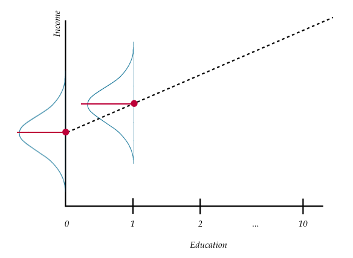

```{r knitr_init, echo=FALSE, cache=FALSE}
library(knitr)
library(rmdformats)

## Global options
options(max.print="75")
opts_chunk$set(prompt=FALSE, comment=NA, message=FALSE, warning=FALSE, tidy=FALSE)
opts_knit$set(width=85)
options(scipen=5)
```


# Introduction and Research Question

In this set of notes, you will begin your foray into regression analysis. To do so, we will use the *riverview.csv* data to examine whether education level is related to income. The data contain five attributes collected from a random sample of $n=32$ employees working for the city of Riverview, a hypothetical midwestern city (see the [data codebook](http://zief0002.github.io/epsy-8251/codebooks/riverview.html)). To begin, we will load several libraries and import the data into an object called `city`.

```{r preparation, warning=FALSE, message=FALSE}
# Load libraries
library(dplyr)
library(ggplot2)
library(readr)

# Read in data
city = read_csv(file = "~/Documents/github/epsy-8251/data/riverview.csv")
head(city)
```

# Data Exploration

Any analysis should start with an initial exploration of the data. During this exploration, you should examine each of the variables that you will be including in the regression analysis. This will help you understand results you get in later analyses, and will also help foreshadow potential problems with the analysis. [This blog post](https://www.analyticsvidhya.com/blog/2016/01/guide-data-exploration/) describes initial ideas of data exploration reasonably well. You could also refer to almost any introductory statistics text for additional detail. 

It is typical to begin by exploring the distribution of each variable used in the analysis separately. These distributions are referred to as *marginal distributions*. After that, it is appropriate to explore the relationships between the variables. 

\newpage

## Income

To begin this exploration, we will examine the marginal distribution of employee incomes. We can plot a marginal distribution using the `sm.density()` function from the **sm** package.

```{r fig.width=6, fig.height=6, out.width='50%', fig.cap="Density plot of employee incomes.", fig.pos='H', fig.align='center'}
ggplot(data = city, aes(x = income)) +
  geom_histogram(aes(y = ..density..), color = "black", fill = "yellow") +
  stat_density(geom = "line") +
  theme_bw() +
  xlab("Income (in thousands of dollars)") +
  ylab("Probability density")
```

This plot suggests that the distribution of employee incomes is unimodal and most of the incomes are between roughly \$50,000 and \$70,000. The rug at the bottom of the plot (the small vertical line segments) show the actual sample incomes. The smallest income in the sample is about \$25,000 and the largest income is over \$80,000. (We could find the exact values using the `summary()` function.) This suggests there is a fair amount of variation in the data. 

To further summarize the distribution, it is typical to compute and report summary statistics such as the mean and standard deviation. One way to compute these values is to use functions from the **dplyr** library.

```{r}
city %>% 
  summarize(
    M = mean(income), 
    SD = sd(income)
    )
```

\newpage

Describing this variable we might write,

\begin{mdframed}[style=mystyle2]
The marginal distribution of income is unimodal with a mean of \$53,742. There is variation in employees' salaries (SD = \$14,553). 
\end{mdframed}


## Education Level

We will also examine the distribution of the education level variable.

```{r fig.width=6, fig.height=6, out.width='50%', fig.cap="Density plot of employee education levels.", fig.pos='H', fig.align='center'}
# Plot
ggplot(data = city, aes(x = education)) +
  geom_histogram(aes(y = ..density..), color = "black", fill = "yellow") +
  stat_density(geom = "line") +
  theme_bw() +
  xlab("Education level") +
  ylab("Probability density")
```


```{r}
# Summary statistics
city %>% 
  summarize(
    M = mean(education), 
    SD = sd(education)
    )
```

\newpage

Again, we might write,

\begin{mdframed}[style=mystyle2]
The marginal distribution of education is unimodal with a mean of 16 years. There is variation in employees' level of education (SD = 4.4).
\end{mdframed}


## Relationship Between Variables

Although examining the marginal distributions is an important first step, those descriptions do not help us directly answer our research question. To better understand any relationship between income and education level we need to explore how the distribution of income differs as a function of education. To do this, we will create a scatterplot of incomes versus education. 


### Scatterplot

```{r fig.width=6, fig.height=6, out.width='3.5in', fig.cap="Scatterplot displaying the relationship between employee education levels and incomes.", fig.pos='H', fig.align='center'}
ggplot( data = city, aes(x = education, y = income) ) +
  geom_point() +
  theme_bw() +
  xlab("Education (in years)") +
  ylab("Income (in U.S. dollars)")
```


\newpage

The plot suggests a relationship (at least for these employees) between level of education and income. When describing the relationship we want to touch on four characteristics of the relationship:

- Functional form of the relationship
- Direction
- Strength
- Observations that do not fit the trend (outliers)


# Statistical Model

Since the relationship's functional form seems reasonably linear, we will use a *linear model* to describe the data. We can express this model mathematically as,

$$
Y_i = \beta_0 + \beta_1(X_i) + \epsilon_i
$$

In this equation,

- $Y_i$ is the outcome/response value; it has an $i$ subscript because it can vary across cases/individuals.
- $\beta_0$ is the intercept of the line that best fits the data; it does not vary across individuals.
- $\beta_1$ is the slope of the line that best fits the data; it does not vary across individuals.
- $X_i$ is the predictor value; it has an $i$ subscript because it can vary across cases/individuals.
- $\epsilon_i$ is the error term; it has an $i$ subscript because it can vary across cases/individuals.

The linear statistical model (i.e., the regression model) can be separated into two components: a *systematic* (or fixed) component and a *random* (or stochastic) component. 

$$
Y_i = \underbrace{\beta_0 + \beta_1(X_i)}_{\substack{\text{Systematic} \\ \text{(Fixed)}}} + \underbrace{\epsilon_i}_{\substack{\text{Random} \\ \text{(Stochastic)}}} 
$$

The systematic (fixed) part of the equation gives the expected value (or mean value) of $Y$ given a particular $X$-value. The notation for the expected value $Y$ is $E(Y_i)$. We express this mathematically as, 

$$
E(Y_i \vert X) = \beta_0 + \beta_1(X_i).
$$

Sometimes statisticians will use the notation of $\mu_{Y \vert X_i}$ rather than the expected value notation. This is read, *the mean value of Y given a particular X-value*. (Another name for this is the conditional mean of $Y$.) Thus, the same equation can be written as,

$$
\mu_{Y \vert X_i} = \beta_0 + \beta_1(X_i).
$$


The terms $\beta_0$ and $\beta_1$ are referred to as the regression parameters. One of the primary goals of a regression analysis is to estimate the values of the regression parameters (i.e., the intercept and slope terms). (Note that the equation for the expected value does not include any error terms.) 

## Conditional Means

To help better understand the idea of conditional means, consider the following plot:

```{r echo=FALSE, out.width='3.5in', out.height='3.5in', fig.align='center', fig.pos='H', fig.cap="Plot displaying conditional distribution of $Y$ at several $X$ values. The OLS fitted regression line (dotted) is also shown. The red points show the mean value of $Y$ for each conditional distribution."}
include_graphics("images/conditional-means.png")
```

At each value of $X$ there is a distribution of $Y$. For example, there would be a distribution of incomes for the employees with an education level of 10 years (in the population). There would be another distribution of incomes for the employees with an education level of 11 years (in the population). And so on. 

When we assume a linear functional form for the model, we are saying that *the mean value of $Y$ differs by a constant amount for each one-unit difference in $X$*. In other words, the difference between the mean income for those employees who have ten years of education and those that have 11 years of education *is the same as* the difference between the mean income for those employees who have 17 years of education and those that have 18 years of education.

## Residuals

Now we can re-write the statistical model, substituting $\mu_{Y \vert X_i}$ in to the systematic part of the model.

$$
\begin{split}
Y_i &= \beta_0 + \beta_1(X_i) + \epsilon_i \\
Y_i &= \mu_{Y \vert X_i} + \epsilon_i 
\end{split}
$$

This equation implies that each observed $Y$-value is the sum of the conditional mean value of $Y$ (which is based on the $X$-value) and some residual (or error) term. Re-arranging the terms, we can mathematically express the residual term as,

$$
\epsilon_i = Y_i - \mu_{Y \vert X_i}
$$

\newpage

To compute an observation's residual, we compute the difference between the observation's $Y$-value and its conditional mean value. When the observed value of $Y$ is larger than the conditional mean value of $Y$ the residual term will be positive (underprediction). If the observed value of $Y$ is smaller than the conditional mean value of $Y$ the residual term will be negative (overprediction).

### Why is there an error term in the statistical model?

We use a single line to describe the relationship between education and income. This line is the same for all of the observations in the sample. For example, look at the figure below which shows the relationship between education and income, but this time also includes the regression line.

```{r echo=FALSE, fig.width=6, fig.height=6, out.width='3.5in', fig.cap="Scatterplot displaying the relationship between employee education levels and incomes. The OLS fitted regression line is also displayed.", fig.pos='H', fig.align='center'}
ggplot( data = city, aes(x = education, y = income) ) +
  geom_point() +
  geom_smooth(method = "lm", se = FALSE) +
  geom_point(x = 10, y = 37831, color = "blue", size = 4) +
  theme_bw() +
  xlab("Education (in years)") +
  ylab("Income (in U.S. dollars)")
```

Consider all the employees that have an education level of 10 years. For all three of them we would predict an income of approximately \$37,800. This is denoted by the blue point on the line. The error term allows for discrepancy between the predicted $Y$ and the observed $Y$, which allows us to recover our observed value of the response variable from the model.

Graphically, the residual is represented by the vertical distance between the line and a given point on the scatterplot. Some of those points are above the line (they have a positive residual) and some are below the line (they have a negative residual). Also note that for some observations the error term is smaller than for others.

\newpage

## Fitted Regression Model

The regression model describes the linear relationship in the *population*. Greek letters indicate a *parameter* (a summary of the population). That is why we use the Greek letter $\beta$ when we notate the regression model. It is important to note that outside of the $X$- and $Y$-values, the parameters ($\beta_0$ and $\beta_1$) and hence the residual values ($\epsilon_i$) are *unobserved*. 

In most statistical analyses, you will use a *sample* of data (not the entire population). When we summarize a sample, it is referred to as a *statistic*, and we use either Roman letters or a Greek letter with a hat. Thus, after fitting the statistical model to the sample data we will get *parameter estimates* for all the unobserved values\footnote{Note that sometimes people use Roman letters when referring to sample estimates: $\hat{Y}_i = b_0 + b_1(X_i)$.},

$$
Y_i = \hat\beta_0 + \hat\beta_1(X_i) + \hat\epsilon_i
$$

This is referred to as the *fitted regression model*. The parameter estimates in the fitted model ($\hat\beta_0$ and $\hat\beta_1$) are typically referred to as *regression coefficients*. 

## Fitted Regression Equation

Applied researchers and statisticians tend to focus their analysis on the conditional means. After fitting the model to the data, the estimated conditional means can be expressed as:

$$
\hat\mu_{Y \vert X_i} = \hat\beta_0 + \hat\beta_1(X_i)
$$

Applied researchers and statisticians also tend to express the conditional mean using the notation $\hat{Y}_i$ rather than $\hat\mu_{Y \vert X_i}$.

$$
\hat{Y}_i = \hat\beta_0 + \hat\beta_1(X_i)
$$

This "y-hat" notation indicates that the summary measure is an estimate of the parameter that resulted from fitting the model to the data, and is typically referred to as the *fitted regression equation*. Before illustrating these ideas using a dataset, note that we can also use the estimated regression coefficients to get estimates for the residuals, often referred to as the *observed residuals*,

$$
\hat\epsilon_i = Y_i - \hat{Y}_i
$$

Each observed residual is the difference between a case's observed outcome and its predicted value (given it's $X$-value and the estimated regression coefficients). Since $\hat{Y}_i$ is the conditional mean, the residual represents an observation's deviation from the mean $Y$-value given it's $X$-value.

\newpage

# Fitting a Regression Model to Data Using R

To fit the regression model to data using R, we will use the `lm()` function. The syntax for this function looks like this:

> `lm(`**outcome** ~ `1 + ` **predictor**, `data =` **dataframe**`)`

where **outcome** is the name of the outcome/response variable, **predictor** is the name of the predictor variable, and **dataframe** is the name of the data frame. (The one on the right side of the tilde tells R to include the intercept in its computation.) When we fit a regression model in R, we will also assign the output to a new object in R. Below, we fit the model using education level to predict income. Here the output is assigned to an object called `lm.1`. We can print the regression parameter estimates by typing the `lm()` object name and hitting enter.

```{r}
# Fit regression model
lm.1 = lm(income ~ 1 + education, data = city)

# Print regression coefficients
lm.1
```

Here the parameter estimates (or regression coefficients) are:

- $\hat{\beta}_0 = 11.321$
- $\hat{\beta}_1 = 2.651$

Remember that these are estimates and need the hats. The fitted regression equation is:

$$
\hat{\mathrm{Income}_i} = 11.321 + 2.651(\mathrm{Education~Level}_i)
$$

## Intercept Interpretation

The estimate for the intercept was 11.321. Graphically, this value indicates the $y$-value where the line passes through the $y$-axis (i.e., $y$-intercept). As such, it gives the $\hat{Y}_i$ or predicted value when $X = 0$. Algebraically we get the same thing if we substitute 0 in for $X_i$ in the fitted regression equation.

$$
\begin{split}
\hat{Y}_i &= \hat{\beta}_0 + \hat{\beta}_1(0) \\
\hat{Y}_i &= \hat{\beta}_0 
\end{split}
$$

\newpage

To interpret this value, remember that $\hat{Y}_i$ is a conditional mean. In this case, it represents the predicted mean income for all employees that have an education level of 0 years. Graphically this looks like the following.

```{r echo=FALSE, out.width='3.5in', out.height='3.5in', fig.align='center', fig.pos='H', fig.cap="Plot displaying conditional distribution of $Y$ at $X=0$. The OLS fitted regression line (dotted) is also shown. The red points show the mean value of $Y$ for this conditional distribution---which corresponfds to the intercept value of the regression line."}
include_graphics("images/conditional-means-intercept.png")
```

Interpreting the intercept coefficient from our example,

\begin{mdframed}[style=mystyle2]
The predicted mean income for all employees that have an education level of 0 years is \$11,321.
\end{mdframed}


## Slope Interpretation

Recall from algebra that the slope of a line describes the change in $Y$ versus the change in $X$. In regression, the slope describes the *predicted* change in $\hat{Y}$ for a one-unit difference in $X$. In our example,

$$
\hat{\beta}_1 = \frac{\Delta\hat{Y}}{\Delta X} = \frac{2.651}{1}
$$

\newpage

Again, because $\hat{Y}$ is a conditional mean, the slope represents the difference in predicted mean incomes for each one-year difference in education level. Graphically,

```{r echo=FALSE, out.width='3.5in', out.height='3.5in', fig.align='center', fig.pos='H', fig.cap="Plot displaying conditional distribution of $Y$ at $X=0$ and $X=1$. The OLS fitted regression line (dotted) is also shown. The red points show the mean value of $Y$ for these conditional distributions---the relative change which corresponds to the slope value of the regression line."}

```

Interpreting the slope coefficient in our example, 

\begin{mdframed}[style=mystyle2]
Each one-year difference in education level is associated with a \$2,651 difference in predicted mean income.
\end{mdframed}

To better understand this, consider the mean income for city employees with three different education levels. The first set of employees have an education level of 10 years. The second set have an education level of 11 years, and the third set have an education level of 12 years. Now let's compute each set of employees' predicted mean income.

$$
\begin{split}
\mathbf{Education=10:~}\hat{\mathrm{Income}} &= 11.321 + 2.651(10) \\
&= 37.831
\end{split}
$$


$$
\begin{split}
\mathbf{Education=11:~}\hat{\mathrm{Income}} &= 11.321 + 2.651(11) \\
&= 40.482
\end{split}
$$


$$
\begin{split}
\mathbf{Education=12:~}\hat{\mathrm{Income}} &= 11.321 + 2.651(12) \\
&= 43.133
\end{split}
$$

Each set of employees' education levels differ by one year (10 to 11 to 12). The difference in predicted mean incomes for these employees differs by 2.651 thousand dollars. 

\newpage

# Using the Regression Equation

Consider the 25th case in the data frame.

```{r}
city %>%
  filter(row_number() == 25)
```

This employee (Employee 25) has an education level of 20 years ($X_{25}=20$). Her income is 54.672 thousand dollars ($Y_{25}=54.672$). Using the fitted regression equation, we can compute the predicted mean income for employees with 20 years of education as,

```{r}
# Y_hat = b0 + b1 * X
11.321 + 2.651 * 20
```

$\hat{Y}_{25} = \hat\mu_{Y \vert X=20} = 64.341$. 

We can also compute Employee 25's residual.

```{r}
# e = Y - Y_hat
54.672 - 64.341
```


The negative residual, $\hat\epsilon_{25} = -9.669$, suggests that this employee earns \$9,669 less than the average predicted income for employees with 20 years of education. We can also represent these values graphically.

```{r echo=FALSE, fig.width=6, fig.height=6, out.width='3in', fig.cap="Plot displaying the OLS fitted regression line (blue) between employee education levels and incomes. The 25th employee's observed data (black dot) is plotted, and a visual representation of the employee's residual (red line) is also displayed.", fig.pos='H', fig.align='center'}
ggplot(data = city, aes(x = education, y = income)) +
  geom_segment(x = 20, xend = 20, y = 64.341, yend = 54.672, color = "darkred") +
  geom_point(x = 20, y = 54.672, size = 4) +
  geom_smooth(method = "lm", se = FALSE) +
  geom_point(x = 20, y = 64.341, color = "blue", size = 4) +
  annotate("text", x = 21, y = 64.341, label = "hat(Y)[25]", parse = TRUE) +
  annotate("text", x = 21, y = 54.672, label = "Y[25]", parse = TRUE) +
  annotate("text", x = 21, y = 59.5065, label = "hat(epsilon)[25]", parse = TRUE) +
  theme_bw() +
  xlab("Education (in years)") +
  ylab("Income (in U.S. dollars)")
```


